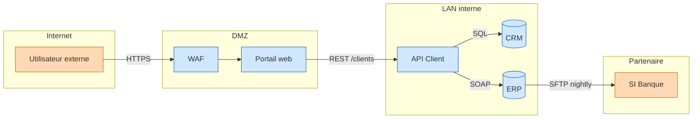
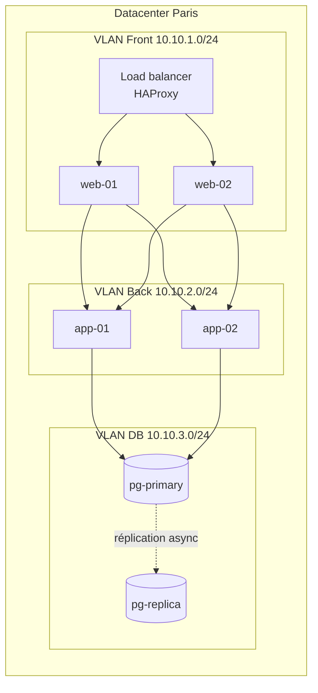
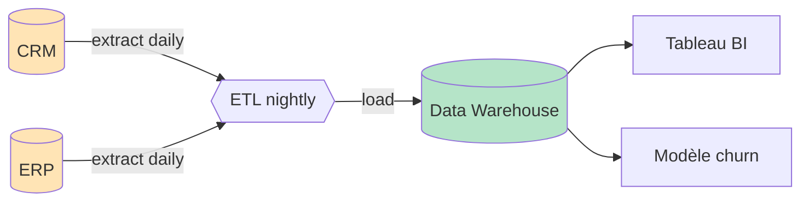
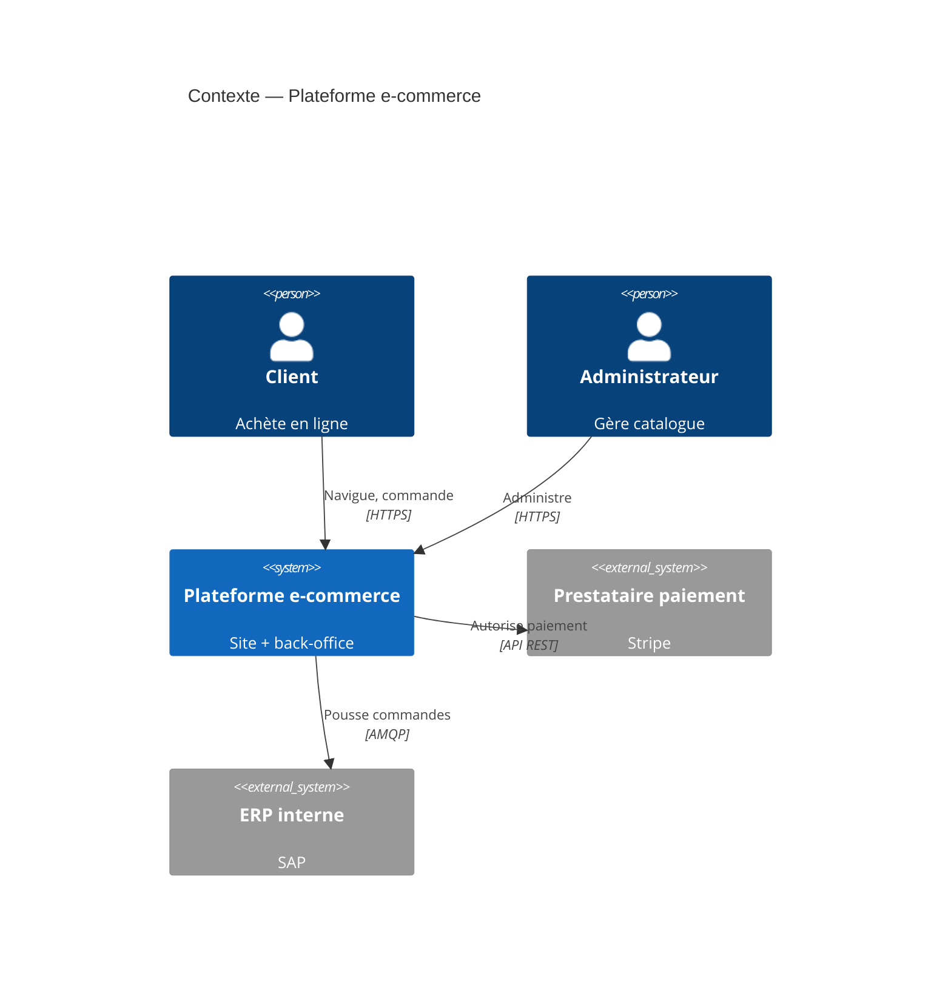
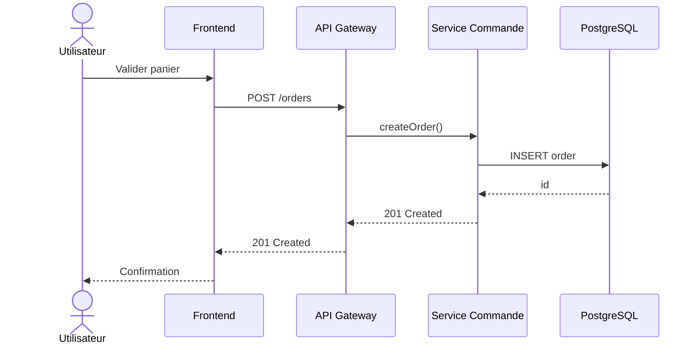

# Patterns Mermaid pour la cartographie SI

Mermaid est idéal pour des diagrammes lisibles, versionnables et intégrables dans Markdown (GitLab, GitHub, Notion, Confluence récent).

## Vue applicative — flowchart avec zones

Le `subgraph` matérialise les zones (DMZ, LAN, cloud, partenaire). C'est l'outil le plus important pour une carto lisible.



Conventions retenues :
- forme `[(...)]` pour une base de données
- forme `[...]` pour un composant applicatif
- étiquette systématique sur les flux avec protocole
- `classDef` pour coloriser par zone de confiance

## Vue infrastructure — flowchart avec nœuds et VLAN



Astuces :
- `direction TB` dans un subgraph pour contrôler l'orientation locale
- `A & B --> C & D` pour matrices de connexions
- `-. label .->` pour flèches pointillées (réplication, fallback)

## Vue données — flux et lineage



Notation `{{...}}` pour un traitement/job ; distincte des sources et sinks. Étiqueter la fréquence des flux (daily, real-time, on-demand) — c'est presque toujours la question qu'on pose.

## Vue C4 niveau Contexte

Mermaid supporte C4 nativement (encore en bêta mais utilisable) :



Utiliser C4 quand il faut montrer les acteurs humains et les systèmes externes, pas seulement la tuyauterie interne.

## Vue séquence — appel d'API ou scénario



Utile pour documenter un flux transactionnel critique ou une chaîne de responsabilité.

## Rendu en image

```bash
# Installation one-shot et rendu SVG
npx -p @mermaid-js/mermaid-cli mmdc -i vue-applicative.mmd -o vue-applicative.svg

# PNG avec fond blanc
npx -p @mermaid-js/mermaid-cli mmdc -i vue.mmd -o vue.png -b white
```

Mermaid rend aussi directement dans GitLab/GitHub Markdown (bloc ```mermaid```), ce qui est souvent suffisant — pas besoin de produire un PNG.

## Pièges Mermaid

- Les `(` `)` `[` `]` dans les labels cassent le parser. Les échapper avec des guillemets : `A["Libellé (avec parenthèses)"]`
- Les diagrammes avec >50 nœuds deviennent souvent illisibles. Scinder en plusieurs vues.
- L'orientation `LR` (gauche→droite) est presque toujours plus lisible que `TD` pour une vue applicative avec flux.
