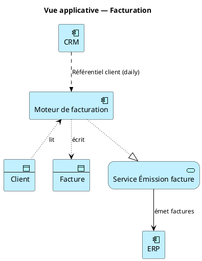

# PlantUML + ArchiMate

PlantUML dispose d'une bibliothèque ArchiMate officieuse très complète (`Archimate.puml` de Xavier Mamelin) maintenue sur GitHub, incluse dans la distribution PlantUML récente.

## Include standard

```plantuml
@startuml
!include <archimate/Archimate>
```

Si ce chemin ne fonctionne pas (vieille version), utiliser l'URL :

```plantuml
!include https://raw.githubusercontent.com/plantuml-stdlib/Archimate-PlantUML/master/Archimate.puml
```

## Éléments les plus utiles

Nommer les éléments en snake_case en interne, libellé lisible entre guillemets.

### Application Layer

```plantuml
Application_Component(crm, "CRM Salesforce")
Application_Service(svc_client, "Service Client 360")
Application_Interface(api_client, "API REST /clients")
Application_DataObject(do_client, "Fiche client")
Application_Collaboration(collab, "Collaboration facturation")
```

### Technology Layer

```plantuml
Technology_Node(srv_prod, "Serveur app-prod-01")
Technology_Device(rtr, "Routeur core")
Technology_SystemSoftware(pg, "PostgreSQL 15")
Technology_Network(lan, "LAN production")
Technology_Artifact(docker_img, "app:1.4.2")
Technology_Service(svc_stockage, "Stockage objet S3")
```

### Business Layer (si besoin)

```plantuml
Business_Actor(commercial, "Commercial")
Business_Process(proc_fact, "Processus facturation")
Business_Service(svc_fact, "Service de facturation")
```

## Relations

```plantuml
Rel_Composition(a, b)
Rel_Aggregation(a, b)
Rel_Realization(a, b)
Rel_Serving(a, b, "sert")
Rel_Flow(a, b, "XML quotidien")
Rel_Triggering(a, b, "déclenche")
Rel_Access_rw(a, b, "lit/écrit")
Rel_Access_r(a, b, "lit")
Rel_Access_w(a, b, "écrit")
Rel_Assignment(a, b)
```

Toujours étiqueter les `Rel_Flow` et `Rel_Serving` (3e argument) — un flux anonyme n'a aucune valeur documentaire.

## Exemple complet — vue de cooperation applicative



## Grouping — matérialiser les zones

```plantuml
rectangle "DMZ" <<zone_dmz>> {
    Application_Component(portail, "Portail public")
}
rectangle "LAN interne" <<zone_lan>> {
    Application_Component(crm, "CRM")
    Application_Component(erp, "ERP")
}
```

## Layout — contrôler la mise en page

PlantUML est capricieux sur le layout. Outils en ordre de préférence :

1. **`left to right direction`** en début de diagramme — presque toujours indispensable pour les vues applicatives.
2. **Relations verticales forcées** : `a -[hidden]d- b` pour imposer que `b` soit sous `a`.
3. **`skinparam linetype ortho`** pour des flèches orthogonales (plus lisible en carto dense).
4. Si le résultat reste mauvais, passer à Mermaid ou à un outil d'édition visuelle (Archi, draw.io). PlantUML n'est pas un outil de DAO.

## Rendu

```bash
# Debian/Ubuntu
sudo apt install plantuml
plantuml vue.puml              # PNG
plantuml -tsvg vue.puml        # SVG (à préférer pour zoom)

# Sans installation
curl -L https://github.com/plantuml/plantuml/releases/latest/download/plantuml.jar -o plantuml.jar
java -jar plantuml.jar -tsvg vue.puml
```

## Quand préférer PlantUML à Mermaid

- Besoin d'une vue ArchiMate *stricte* (audit, livrable contractuel, conformité TOGAF).
- Diagrammes complexes où le typage riche des éléments apporte de la valeur (un lecteur averti lit l'icône et sait immédiatement s'il regarde un composant applicatif ou un nœud d'infra).
- Export SVG propre pour intégration dans un document Word/PDF final.

Dans tous les autres cas, Mermaid est plus simple à éditer et à intégrer.
